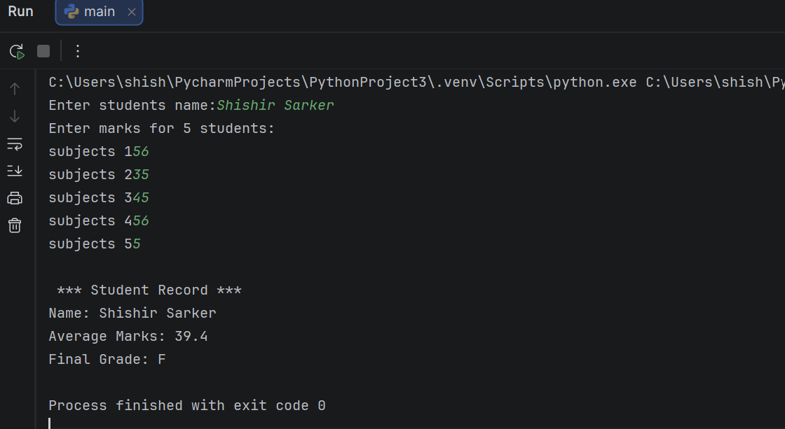

#   **_Project Overview_**

This project is a simple Python program that takes a student’s name and marks of 5 subjects as input. It then calculates the average marks and assigns a grade. All the data is stored in a dictionary.

# **_Project Goal_**

**To understand:**

1.Python basics
2.Loops
3.If-else conditions
4.Input and output
5.Dictionaries

## Program Output

# **What This Program Does**

1.Takes student name as input
2.Takes marks of 5 subjects
3.Calculates the average
4.Assigns a grade (A, B, or C)
5.Stores all data in a dictionary

## How to Run
1. Clone repo  
2. Open terminal  
3. Run `python main.py`
   
### Requirements
* Python 3.14.2

# **Grading System**

Average ≥ 80 → Grade A
Average ≥ 60 → Grade B
Average < 60 → Grade C

## Technologies Used
**Python**

# **Author**
**Shishir Sarker**
